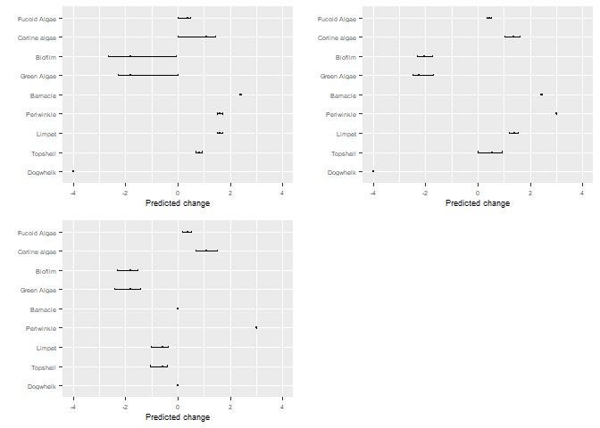
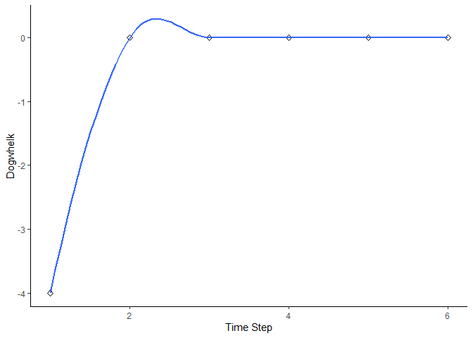
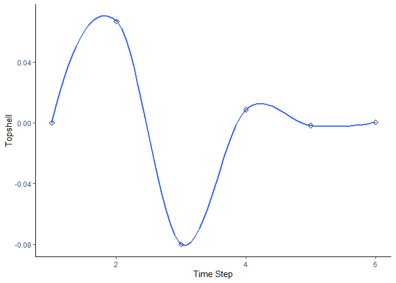
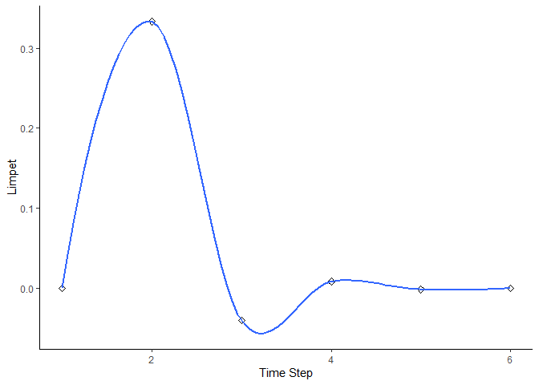
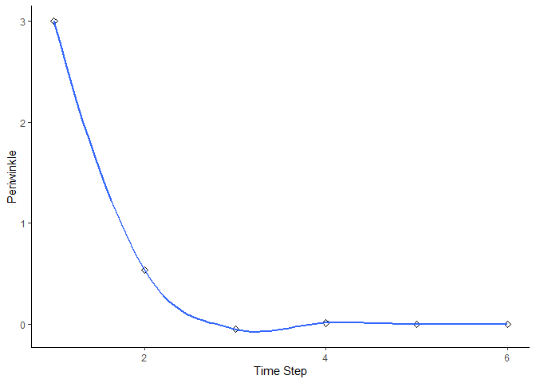
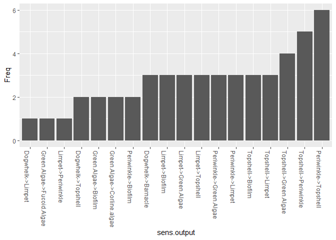
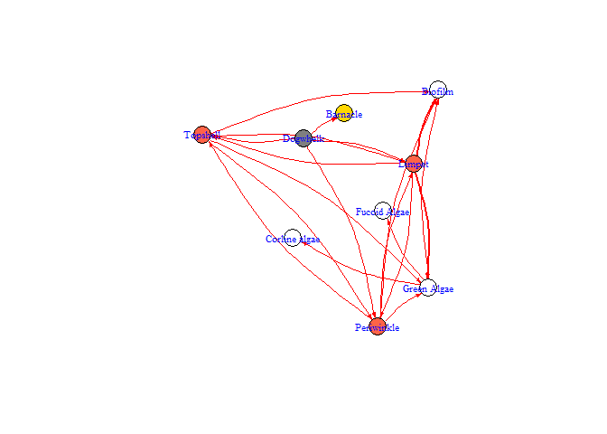

BBNet – Simple predictive models based on Bayesian belief networks
================
Victoria Dominguez Almela & Richard Stafford
31 July, 2025

- [bbnet
  </a>](#bbnet-)
- [Introduction](#introduction)
- [Installation](#installation)
- [Basic steps to get started](#basic-steps-to-get-started)
  - [How to load the data in R?](#how-to-load-the-data-in-r)
  - [Running a predictive model](#running-a-predictive-model)
  - [bbn.predict()](#bbnpredict)
  - [Visualising changes over time](#visualising-changes-over-time)
  - [bbn.timeseries()](#bbntimeseries)
  - [bbn.visualise()](#bbnvisualise)
  - [Parameterisation of the model](#parameterisation-of-the-model)
  - [bbn.sensitivity()](#bbnsensitivity)
  - [Visualising the network](#visualising-the-network)
  - [bbn.network.diagram()](#bbnnetworkdiagram)
- [Improving the package](#improving-the-package)
- [Citation](#citation)

<!-- README.md is generated from README.Rmd. Please edit that file -->

# bbnet </a>

<!-- badges: start -->

[](https://CRAN.R-project.org/package=bbnet)
[](https://app.codecov.io/gh/vda1r22/bbnet?branch=main)
[](https://github.com/vda1r22/bbnet/actions/workflows/R-CMD-check.yaml)
<!-- badges: end -->

# Introduction

The BBNet R package provides a comprehensive suite of tools for
building, visualising, and analysing Bayesian Belief Networks.

It aims to facilitate decision-making by enabling users to model complex
processes and infer probabilities of various outcomes. The package is
designed to be user-friendly, making advanced probabilistic modelling
techniques accessible to ecology and environmental researchers and
practitioners.

# Installation

You can install the development version of BBNet from
[GitHub](https://github.com/) with:

``` r
# install.packages("devtools")
#devtools::install_github("vda1r22/bbnet")
install.packages("bbnet")
```

# Basic steps to get started

## How to load the data in R?

With the exception of the bbn.network.diagram() function, all functions
require a network model in the format below. It is easiest to read these
into the R environment from a csv file. For this example, we will open
the Rocky Shore model which comes as an example dataset within the BBNet
package.

``` r
library(bbnet)
#> Loading required package: dplyr
#> 
#> Attaching package: 'dplyr'
#> The following objects are masked from 'package:stats':
#> 
#>     filter, lag
#> The following objects are masked from 'package:base':
#> 
#>     intersect, setdiff, setequal, union
#> Loading required package: ggplot2
#> Loading required package: grid
#> Loading required package: igraph
#> 
#> Attaching package: 'igraph'
#> The following objects are masked from 'package:dplyr':
#> 
#>     as_data_frame, groups, union
#> The following objects are masked from 'package:stats':
#> 
#>     decompose, spectrum
#> The following object is masked from 'package:base':
#> 
#>     union
#> Loading required package: tibble
#> 
#> Attaching package: 'tibble'
#> The following object is masked from 'package:igraph':
#> 
#>     as_data_frame

data("my_BBN")

head(my_BBN)
#>             X Dogwhelk Topshell Limpet Periwinkle Barnacle Green.Algae Biofilm
#> 1    Dogwhelk       NA       -1     -2         -2       -3          NA      NA
#> 2    Topshell       NA       NA     -1         -1       NA          -3      -3
#> 3      Limpet       NA       -2     NA         -2       NA          -4      -4
#> 4  Periwinkle       NA       -1     -1         NA       NA          -3      -3
#> 5    Barnacle       NA       NA     NA         NA       NA          NA      NA
#> 6 Green Algae       NA       NA     NA         NA       NA          NA      -2
#>   Corline.algae Fucoid.Algae
#> 1            NA           NA
#> 2            NA           NA
#> 3            NA           NA
#> 4            NA           NA
#> 5            NA           NA
#> 6            -3           -1
```

The details of this interaction matrix are discussed in the main text of
the paper, which is under review in *Ecological Informatics* \[we will
update this shortly\]. Essentially it explains direct interactions
between what is here the species or taxon in the *row* on the species or
taxon in the *column*.

It is also normal in most functions to have a scenario or scenarios
which we want to investigate. In this rocky shore example, we have three
scenarios - the removal of dogwhelks, the addition of periwinkles and a
combination treatment, where dogwhelks are removed and periwinkles
added. Some of these scenarios and the model are described in more
detail in [this paper](https://doi.org/10.1016/j.ocecoaman.2015.04.013).

Scenarios are loaded in as follows:

``` r
data("dogwhelk", "winkle", "combined")

head(dogwhelk)
#>   Increase        Node
#> 1       -4    Dogwhelk
#> 2        0    Topshell
#> 3        0      Limpet
#> 4        0  Periwinkle
#> 5        0    Barnacle
#> 6        0 Green Algae
```

In this case, any planned manipulation of the system (i.e. direct
effects on the system) are listed - here all dogwhelks are removed, so a
value of -4 is given (scale from -4 -strong decrease, to +4, strong
increase).

## Running a predictive model

## bbn.predict()

We can run a predictive model on up to 12 scenarios at a time using the
bbn.predict() function. As a minumum, we need to pass the network model
and one scenario to the function.

``` r
bbn.predict(bbn.model = my_BBN, priors1 = dogwhelk, figure = 0) # figure set to zero, this is explained below
#> Warning in bbn.predict(bbn.model = my_BBN, priors1 = dogwhelk, figure = 0):
#> Node names in priors are different to those in the interaction matrix - prior
#> names will be used, but please check order of nodes is identical
#> [1] "Scenario number  1"
#>     Increase          name    LowerCI    UpperCI
#> 1 -4.0000000      Dogwhelk -4.0000000 -4.0000000
#> 2  0.8000000      Topshell  0.8000000  0.8000000
#> 3  1.6000000        Limpet  1.6000000  1.6000000
#> 4  1.6000000    Periwinkle  1.6000000  1.6000000
#> 5  2.4000000      Barnacle  2.4000000  2.4000000
#> 6 -1.7985382   Green Algae -1.7985382 -1.7985382
#> 7 -0.6800000       Biofilm -0.6800000 -0.6800000
#> 8  1.0791229 Corline algae  1.0791229  1.0791229
#> 9  0.3597076  Fucoid Algae  0.3597076  0.3597076
```

The output given above shows the *posterior* outcome of the model as a
result of dogwhelks decreasing - under the Increase column. Grazers
increase (positive values) and some of the seaweeds which would be
grazed by the grazers decreases. As the paper above explains, this is a
short-term prediction model, so some seaweed actually increases in this
scenario. There are also confidence intervals of our predictions -
currently these show no difference to the main values, but we can
bootstrap the model to gain an idea of the confidence of the
predictions.

### Function arguments

*Required arguments*

*bbn.model* - a matrix or dataframe of interactions between different
model *nodes*

*priors1* - an X by 2 array of initial changes to the system under
investigation. The first column should be a -4 to 4 (including 0)
integer value for each node in the network with negative values
indicating a decrease and positive values representing an increase. 0
represents no change. Note, names included here are included as outputs
in tables and figures (note misspelling of coraline algae in examples).
Shortening these names can provide better figures

*Optional Arguments*

*priors2 - priors12 -* as above, but additional scenarios.

*boot_max* - the number of bootstraps to perform. Suggested range for
exploratory analysis 1-1000. For final analysis recommended size =
1000 - 10000 - note, this can take a long time to run. Default value is
1, running with no bootstrapping - suitable for exploration of data and
error checking.

*values -* default value 1. This provides a numeric output of posterior
values and any confidence intervals. Set to 0 to hide this output

*figure -* default value 1. Sets the figure options. 0 = no figures
produced. 1 = figure is saved in working directory as a PDF file (note,
this is overwritten if the name is not changed, and no figure is
produced if the existing PDF is open when the new one is generated). 2 =
figure is produced in a graphics window. All figures are combined on a
single plot where scenario 2 is below scenario 1 (i.e. scenarios work in
columns then rows)

*font.size -* default = 5. This sets the font size on the figures.

*Example*

``` r
bbn.predict(bbn.model = my_BBN, priors1 = dogwhelk, priors2 = winkle, priors3= combined, figure = 2, boot_max = 100, values = 0, font.size = 7)
#> Warning in bbn.predict(bbn.model = my_BBN, priors1 = dogwhelk, priors2 =
#> winkle, : Node names in priors are different to those in the interaction matrix
#> - prior names will be used, but please check order of nodes is identical
#> Warning in bbn.predict(bbn.model = my_BBN, priors1 = dogwhelk, priors2 =
#> winkle, : Node names in priors are different to those in the interaction matrix
#> - prior names will be used, but please check order of nodes is identical
#> Warning in bbn.predict(bbn.model = my_BBN, priors1 = dogwhelk, priors2 =
#> winkle, : Node names in priors are different to those in the interaction matrix
#> - prior names will be used, but please check order of nodes is identical
```



You can extract the prediction results for any scenario:

``` r
results <- bbn.predict(bbn.model = my_BBN, priors1 = dogwhelk, priors2 = winkle, priors3= combined, boot_max = 100)
#> Warning in bbn.predict(bbn.model = my_BBN, priors1 = dogwhelk, priors2 =
#> winkle, : Node names in priors are different to those in the interaction matrix
#> - prior names will be used, but please check order of nodes is identical
#> [1] "Scenario number  1"
#>     Increase          name     LowerCI    UpperCI
#> 1 -4.0000000      Dogwhelk -4.00000000 -4.0000000
#> 2  0.8000000      Topshell  0.17889751  1.0123913
#> 3  1.6000000        Limpet  0.52557752  1.8476517
#> 4  1.6000000    Periwinkle  0.52729988  1.8315324
#> 5  2.4000000      Barnacle  2.39406954  2.4197561
#> 6 -1.7985382   Green Algae -2.54492119  0.0000000
#> 7 -0.6800000       Biofilm -1.92631138  0.0000000
#> 8  1.0791229 Corline algae  0.02409555  1.6009148
#> 9  0.3597076  Fucoid Algae  0.00000000  0.5413387
#> Warning in bbn.predict(bbn.model = my_BBN, priors1 = dogwhelk, priors2 =
#> winkle, : Node names in priors are different to those in the interaction matrix
#> - prior names will be used, but please check order of nodes is identical
#> [1] "Scenario number  2"
#>   Increase          name     LowerCI     UpperCI
#> 1     0.00      Dogwhelk  0.00000000  0.00000000
#> 2    -0.20      Topshell -0.36551060  0.00000000
#> 3    -0.20        Limpet -0.38948433 -0.06801676
#> 4     3.00    Periwinkle  3.00000000  3.00000000
#> 5     0.00      Barnacle  0.00000000  0.00000000
#> 6    -0.60   Green Algae -0.73628567 -0.47616121
#> 7    -0.45       Biofilm -0.62016064 -0.30546208
#> 8     0.36 Corline algae  0.13915245  0.48142605
#> 9     0.12  Fucoid Algae  0.06698419  0.42260373
#> Warning in bbn.predict(bbn.model = my_BBN, priors1 = dogwhelk, priors2 =
#> winkle, : Node names in priors are different to those in the interaction matrix
#> - prior names will be used, but please check order of nodes is identical
#> [1] "Scenario number  3"
#>      Increase          name    LowerCI    UpperCI
#> 1 -4.00000000      Dogwhelk -4.0000000 -4.0000000
#> 2  0.06666667      Topshell  0.0000000  0.8163132
#> 3  0.33333333        Limpet  0.1735027  0.4702048
#> 4  3.00000000    Periwinkle  3.0000000  3.0000000
#> 5  2.40000000      Barnacle  2.3885873  2.4165676
#> 6 -1.89779200   Green Algae -2.6037531 -0.7136886
#> 7 -0.46666667       Biofilm -0.6916419 -0.3101190
#> 8  1.13867520 Corline algae  0.4418393  1.5795833
#> 9  0.37955840  Fucoid Algae  0.1327066  0.5898523
results[[2]]$summary  # view the numeric output for scenario 2
#>   Increase          name     LowerCI     UpperCI
#> 1     0.00      Dogwhelk  0.00000000  0.00000000
#> 2    -0.20      Topshell -0.36551060  0.00000000
#> 3    -0.20        Limpet -0.38948433 -0.06801676
#> 4     3.00    Periwinkle  3.00000000  3.00000000
#> 5     0.00      Barnacle  0.00000000  0.00000000
#> 6    -0.60   Green Algae -0.73628567 -0.47616121
#> 7    -0.45       Biofilm -0.62016064 -0.30546208
#> 8     0.36 Corline algae  0.13915245  0.48142605
#> 9     0.12  Fucoid Algae  0.06698419  0.42260373
```

## Visualising changes over time

Two functions help visualise changes over time. It should be noted that
the exact values from these functions do not correspond to the more
robust bbn.predict() - which should be used to inform of likely changes.
These help visualise the flow of information through the network and how
changes progress through the network over time (e.g. should we expect to
see a change in one parameter before another - perhaps as per trophic
cascade or ecological succession type processes)

## bbn.timeseries()

As above we need to pass the function a network model and a scenario as
a minimum. In this case, only one scenario can be analysed at once. The
output is a graph of each node in the network, visualised across the
different timesteps in the model. Note - values are plotted on each
graph and lines of best fit are drawn using the geom_smooth() function.
Typically this function may not perform well with the variability in
values and lack of data points, and multiple warning messages may be
produced.

*Required arguments*

*bbn.model* - a matrix or dataframe of interactions between different
model *nodes*

*priors1* - an X by 2 array of initial changes to the system under
investigation. The first column should be a -4 to 4 (including 0)
integer value for each node in the network with negative values
indicating a decrease and positive values representing an increase. 0
represents no change.

*Optional Arguments*

*timesteps -* default = 5. This is the number of timesteps the model
performs. Note, timesteps are arbitrary and non-linear. However,
something occurring in timestep 2, should occur before timestep 3.

*disturbance -* default = 1. 1 - creates a prolonged or press
disturbance as per the bbn.predict() function. Essentially prior values
for each manipulated node are at least maintained (if not increased
through reinforcement in the model) over all timesteps. 2 - shows a
brief pulse disturbance, which can be useful to visualise changes as
peaks and troughs in increase and decrease of nodes can propagate
through the network

*Example*

``` r
bbn.timeseries(bbn.model = my_BBN, priors1 = combined, timesteps = 6, disturbance = 2)
#> Warning in bbn.timeseries(bbn.model = my_BBN, priors1 = combined, timesteps =
#> 6, : Node names in priors are different to those in the interaction matrix -
#> prior names will be used, but please check order of nodes is identical
#> `geom_smooth()` using formula = 'y ~ x'
```



    #> `geom_smooth()` using formula = 'y ~ x'



    #> `geom_smooth()` using formula = 'y ~ x'



    #> `geom_smooth()` using formula = 'y ~ x'



    #> `geom_smooth()` using formula = 'y ~ x'


    #> `geom_smooth()` using formula = 'y ~ x'


    #> `geom_smooth()` using formula = 'y ~ x'


    #> `geom_smooth()` using formula = 'y ~ x'


    #> `geom_smooth()` using formula = 'y ~ x'


## bbn.visualise()

This function produces a network diagram in each timestep of the model,
rather than the graph produced above. The most important interactions at
that timestep are listed and the colour of nodes changes from black
(showing the highest increase) to white (showing the lowest increase /
largest decrease)

*Required arguments*

*bbn.model* - a matrix or dataframe of interactions between different
model *nodes*

*priors1* - an X by 2 array of initial changes to the system under
investigation. The first column should be a -4 to 4 (including 0)
integer value for each node in the network with negative values
indicating a decrease and positive values representing an increase. 0
represents no change.

*Optional Arguments*

*timesteps -* default = 5. This is the number of timesteps the model
performs. Note, timesteps are arbitrary and non-linear. However,
something occurring in timestep 2, should occur before timestep 3.

*disturbance -* default = 1. 1 - creates a prolonged or press
disturbance as per the bbn.predict() function. Essentially prior values
for each manipulated node are at least maintained (if not increased
through reinforcement in the model) over all timesteps. 2 - shows a
brief pulse disturbance, which can be useful to visualise changes as
peaks and troughs in increase and decrease of nodes can propagate
through the network

*threshold -* default = 0.2. Nodes which deviate from 0 by more than
this threshold value will display interactions with other nodes. As
mentioned, values in these visualisation functions don’t directly
correspond to those in the bbn.predict() function. This value can be
tweaked from 0 to 4 to create the most useful visualisations

*font.size* - default = 0.7. Changes the font in the figure produced.
The value here is a multiplier of the default font size used in the
*igraph* package and does not correspond to the font.size argument in
the bbn.timeseries() function.

*arrow.size* - default = 4. Changes the size of the arrows. Note, sizes
do vary based on interaction strength, so this is a multiplier for
visualisation purposes.

*Example*

``` r
bbn.visualise(bbn.model = my_BBN, priors1 = combined, timesteps = 5, disturbance = 2, threshold=0.05, font.size=0.7, arrow.size=4)
#> Warning in bbn.visualise(bbn.model = my_BBN, priors1 = combined, timesteps = 5,
#> : Node names in priors are different to those in the interaction matrix - prior
#> names will be used, but please check order of nodes is identical
```


    #> NULL


    #> NULL


    #> NULL


    #> NULL


    #> NULL

## Parameterisation of the model

## bbn.sensitivity()

For some methods of model parameterisation, extensive data extraction
from literature, or expert opinion can be useful. However, this is time
consuming, and being aware of the most sensitive parameters in the model
which may affect the desired outputs could help concentrate efforts.
This function produces a list of the most important parameters /
interaction strengths to examine.

*Required arguments*

*bbn.model* - a matrix or dataframe of interactions between different
model *nodes*

One or more nodes (recommended no more than 3) which would be the main
outcomes of interest in the model. The spelling of these nodes needs to
be identical (including capital letters) to that in the imported csv
file (note, you should include spaces if these are in your csv file,
rather than the dot notation used once imported into R).

*Optional arguments*

*boot_max* - the number of bootstraps to perform. Suggested range for
exploratory analysis 100-1000. For final analysis recommended size =
1000 - 10000 - note, this can take a long time to run. Default value is
1000.

*Example use and interpretation*

``` r
bbn.sensitivity(bbn.model = my_BBN, boot_max = 100, 'Limpet', 'Green Algae')
```



    #>                   sens.output Freq
    #> 1         Periwinkle->Biofilm    1
    #> 2       Topshell->Green.Algae    1
    #> 3            Dogwhelk->Limpet    2
    #> 4        Dogwhelk->Periwinkle    2
    #> 5          Dogwhelk->Topshell    2
    #> 6   Green.Algae->Fucoid.Algae    2
    #> 7         Limpet->Green.Algae    2
    #> 8          Periwinkle->Limpet    2
    #> 9        Periwinkle->Topshell    2
    #> 10          Topshell->Biofilm    2
    #> 11            Limpet->Biofilm    3
    #> 12           Topshell->Limpet    3
    #> 13           Limpet->Topshell    4
    #> 14       Green.Algae->Biofilm    5
    #> 15    Periwinkle->Green.Algae    5
    #> 16 Green.Algae->Corline.algae    6
    #> 17       Topshell->Periwinkle    6

The function works by bootstrapping with multiple changes to prior
values and interaction strengths in the network. The frequency shows the
number of times a modified interaction shows up as important in causing
a change to the listed nodes. As such, those interactions showing as
more frequent in the table or figure are likely to be most influential
in any predictions. These should be subject to closer scrutiny in terms
of values used. (note, this does not mean the values are incorrect or
should be reduced from more extreme values - i.e. from 4 to 3, just that
they should be carefully checked)

## Visualising the network

For simple networks visualising the interactions can be useful. In some
more complex cases, network diagrams will only serve to illustrate a
‘complex system’ exists.

## bbn.network.diagram()

This visualises all nodes and interactions in a network, in a similar
manner to the bbn.visualise() package, other than this is the full
network. Nodes can also be colour coded by theme. It is easiest to
create a slightly different csv file to produce these networks, which
allows for the colour coding.

``` r
data("my_network")

head(my_network)
#>    id node.type   node.name Dogwhelk Topshell Limpet Periwinkle Barnacle
#> 1 s01         1    Dogwhelk       NA       -1     -2         -2       -3
#> 2 s02         2    Topshell       NA       NA     -1         -1       NA
#> 3 s03         2      Limpet       NA       -2     NA         -2       NA
#> 4 s04         2  Periwinkle       NA       -1     -1         NA       NA
#> 5 s05         3    Barnacle       NA       NA     NA         NA       NA
#> 6 s06         4 Green Algae       NA       NA     NA         NA       NA
#>   Green.Algae Biofilm Corline.algae Fucoid.Algae
#> 1          NA      NA            NA           NA
#> 2          -3      -3            NA           NA
#> 3          -4      -4            NA           NA
#> 4          -3      -3            NA           NA
#> 5          NA      NA            NA           NA
#> 6          NA      -2            -3           -1
```

Note - in this file, the first column is called `id` and consists of an
s and a 2 digit number relating to the node number. The second column is
called `node.type` and is an integer value from 1-4. This sets the
colour of the node in the network (sticking to a maximum of four
colours). Here, predators, grazers, filter feeders and algae are colour
coded seperately - it would be fine to change the colours, for example
to ensure algae were green. The third column is the same as the first
column in the standard BBN interaction csv, other than it is titled
`node.name`. It is important to use these column names (including
capitals and dot notation). The remainder of the columns are exactly as
the standard BBN interaction csv file.

*Required arguments*

*bbn.network* - a csv file as described above, with note paid to the
first three column names

*Optional arguments*

*font.size* - default = 0.7. Changes the font in the figure produced.
The value here is a multiplier of the default font size used in the
*igraph* package and does not correspond to the font.size argument in
the bbn.timeseries() function.

*arrow.size* - default = 4. Changes the size of the arrows. Note, sizes
do vary based on interaction strength, so this is a multiplier for
visualisation purposes. Negative interactions are shown by red arrows,
and positive interactions by black arrows

*arrange -* this describes how the final diagram looks. Default is
`layout_on_sphere` but `layout_on_grid` provides the same layout as in
the bbn.visualise() function and ensures nodes are structured in the
order specified in the network. Other layouts, including
`layout_on_sphere` are more randomly determined, and better/clearer
diagrams may occur if you run these multiple times. Other options are
from the *igraph* package:

    layout.sphere
    layout.circle
    layout.random
    layout.fruchterman.reingold

*Examples*

``` r
bbn.network.diagram(bbn.network = my_network, font.size = 0.7, arrow.size = 4, arrange = layout_on_sphere)
```


    #> NULL
    bbn.network.diagram(bbn.network = my_network, font.size = 0.7, arrow.size = 2, arrange = layout_on_grid)


    #> NULL
    bbn.network.diagram(bbn.network = my_network, font.size = 0.7, arrow.size = 2, arrange = layout.random)



    #> NULL
    bbn.network.diagram(bbn.network = my_network, font.size = 0.7, arrow.size = 2, arrange = layout.circle)


    #> NULL

# Improving the package

If something is not clear, or missing, or if you would like to request a
feature, please open an issue on [our GitHub
repository](https://github.com/vda1r22/bbnet/issues).

# Citation

If you found the package and/or the tutorial useful, please do not
hesitate to cite the package as an acknowledgement for the time spent in
writing the package and this tutorial.

``` r
citation("bbnet")
#> Warning in citation("bbnet"): could not determine year for 'bbnet' from package
#> DESCRIPTION file
#> To cite package 'bbnet' in publications use:
#> 
#>   Dominguez Almela V, Stafford R (????). _bbnet: Create Simple
#>   Predictive Models on Bayesian Belief Networks_. R package version
#>   1.2.0, <https://github.com/vda1r22/bbnet>.
#> 
#> A BibTeX entry for LaTeX users is
#> 
#>   @Manual{,
#>     title = {bbnet: Create Simple Predictive Models on Bayesian Belief Networks},
#>     author = {Victoria {Dominguez Almela} and Richard Stafford},
#>     note = {R package version 1.2.0},
#>     url = {https://github.com/vda1r22/bbnet},
#>   }
```
